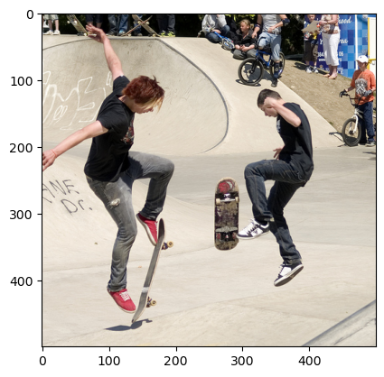
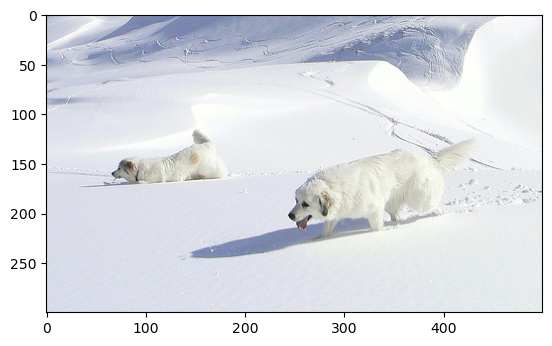

# README

## Dataset
Flickr30K (https://datasets.activeloop.ai/docs/ml/datasets/flickr30k-dataset/) 

## Getting started
```shell
pip install -r requirements.txt
```

## Launch jobs
On Mac OSX
```shell
export PYTORCH_ENABLE_MPS_FALLBACK=1; accelerate launch trainer.py --config_file training_configs/local/nano.yaml --chkpt_file checkpoints/nano.pt
```
To disable MPS / CUDA, do this
```shell
accelerate launch --cpu trainer.py --config_file training_configs/local/nano.yaml --chkpt_file checkpoints/nano.pt
```
Choose configs from `training_configs/local` for local runs or `training_configs/gpu` for gpu runs or 
write your own (In which case it must a yaml file that maps to the `TrainingConfig` class in 
`configs/trainer.py`). Try using `training_configs/local/nano.yaml` for fast prototyping locally.

## Add a new Huggingface model as a decoder?
* Subclass `HuggingfaceDecoder` in `models/decoder.py` like how `GPT2HuggingfaceDecoder` and `FalconHuggingfaceDecoder`
  do so.
* Update the `Decoder.from_config` method in the same file appropriately 

## References
 * Some transformer encoder/decoder code was taken from nanoGPT repository (https://github.com/karpathy/nanoGPT)
 * Huggingface ecosystem (transformers, accelerate and peft libraries and of course the model hub)
 * Momentum distillation (https://arxiv.org/abs/2107.07651). Why does this help? Intuition is this helps with choosing 
   the right scale for learning rate (self-similarity that momentum distillation enforces essentially promotes slower 
   updates)

## Results
Using config `training_configs/local/nano.yaml`



Labels:

1. The teenage boys in black shirts skateboarding in a skate park , surrounded by people 
2. Two teen guys are doing skateboard tricks at a skate park 
3. Two kids in jeans perform skateboard tricks 
4. Two guys are in the air while skateboarding 
5. Two teenagers doing tricks on skateboards

Predictions:

1. A skateboarder doing tricks while playing the skate on skateboards.
2. A man in shorts and a skateboard jumps over a railing.
3. A skateboarder performs a jump on the street.
4. A skateboarder in black boots performs a trick on a skate park.
5. A skateboarder who has not ridden on a bike.
6. A skateboarder with a yellow hat and a blue shirt is performing a trick on a skate ramp.
7. A skateboarder with a skateboarding toy jumps to the side.
8. A man skateboarding on a skateboard.



Labels:

1. Two white dogs walk through a huge bank of mountain snow 
2. Two white dogs are walking through deep white snow 
3. Two fluffy white dogs are in the snow
4. Two white dogs walk in a snowy setting 
5. Two white dogs walking in the snow 


Predictions:

1. A dog runs next to a large snow.
2. A dog running along the snow covered mountains
3. A dog is standing in the snow.
4. A white dog playing in the snow
5. A black dog runs through its snow.
6. A dog in snow.
7. A dog runs down muddy hillside with snow on its back.
8. A small brown dog is running in the snow.

